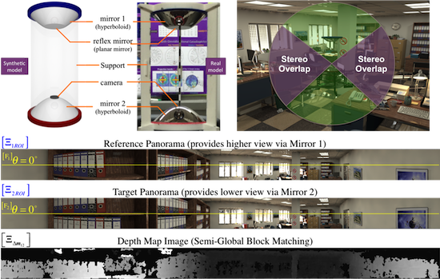

# Supplementary Materials for the "*Design and Analysis of a Single-Camera Omnistereo Sensor for Quadrotor Micro Aerial Vehicles (MAVs)*" 

The following iPython Notebooks reproce the analysis plots performed over the *Theoretical Model* for the catadioptric omnidirectional stereo sensor proposed in the corresponding [Sensors Article](http://www.mdpi.com/1424-8220/16/2/217/) published in February 6, 2016.

#### [Demonstration and Analysis Plots](https://nbviewer.jupyter.org/github/ubuntuslave/omnistereo_sensor_design/blob/master/HyperCata%20Demo.ipynb)

#### [Derivation of Analytical Solutions to Projection and Back-Projection of Theorical Omnistereo Model](https://nbviewer.jupyter.org/github/ubuntuslave/omnistereo_sensor-design/blob/master/Hyperbolic%20Rig.ipynb)

- **Author**: Carlos Jaramillo
- **Contact**: <cjaramillo@gradcenter.cuny.edu>

*Copyright (C)* 2016 under the *Gnu Public License version 2 (GPL2)*

***WARNING***: This code is at an experimental stage
 
## Project Overview

`omnistereo_sensor_design` is a *proof-of-concept* written in Python for depth perception using a custom-designed catadioptric omnidirectional stereo sensor.

## Setup

### Python Modules:

For instance Using Python 3.5, with `pip3`, install the following modules:

    $ pip3 install numpy
    $ pip3 install scipy
    $ pip3 install sympy

For visualization:

    $ pip3 install matplotlib
    $ pip3 install mpldatacursor

***NOTE***: In Linux, you may get *Permission Denied* errors that can be solved by:

    $ sudo rm -rf ~/.cache/pip/

### (Optional) For 3D Visualization:

    $ pip3 install vispy

or 

    $ pip3 install visvis
    

### (Required) OpenCV 3

The following guide uses `Homebrew `for Mac OS X:

#### Requirements:

Make sure you have installed the XCode CLI tools are all installed:

    $ ls -lah /usr/include/sys/types.h 

If not, try:

    $ xcode-select --install

The last release of OpenCV's [Deep Neural Network module](http://docs.opencv.org/master/d6/d0f/group__dnn.html) requires Google's [Protocol Buffers](https://developers.google.com/protocol-buffers/)    

    $ brew install protobuf    
    
However, it *may fail* to find a "suitable threading library available." If so, disable DNN within the CMake configuration (in the next steps)

#### Optional requirement:
    
Install `Qt4` from Homebrew.

    $ brew install qt4

Then, install [PyQT](http://www.riverbankcomputing.co.uk/software/pyqt/intro)

    $ brew install pyqt --with-python3

It can be tested from  a Python Shell:
    
    >>> from PyQt4.QtGui import *

#### Install OpenCV 3

##### The Easy Way Via Homebrew (Mac OS X only):
    
    $ brew install opencv3 --with-contrib --with-ffmpeg --with-gphoto2 --with-gstreamer --with-jasper --with-libdc1394 --with-openni2 --with-python3 --with-qt --with-tbb
    
    $ brew link --overwrite --force opencv3

##### The Hard (more powerful) Way from Source Code:
    
Clone *OpenCV 3* from the repo

    $ cd ~/src
    $ git clone git@github.com:Itseez/opencv.git

And also the ***contributed*** modules:

    $ git clone git@github.com:Itseez/opencv_contrib.git    
    
Then, configure the installation: 

    $ cd opencv
    $ mkdir build
    $ cd build
    $ ccmake ../

##### Configure OpenCV via CMake

To build `OpenCV` with `Qt4` and `Python 3.5`, try without the GUI configuration:  

###### Under OS X:
    
    $ cmake -D CMAKE_BUILD_TYPE=RELEASE -D CMAKE_INSTALL_PREFIX=/usr/local -DWITH_QT=4 -D BUILD_opencv_python3=ON -D PYTHON3_EXECUTABLE=/usr/local/bin/python3 -D PYTHON3_PACKAGES_PATH=lib/python3.5/site-packages -D PYTHON3_LIBRARY=/usr/local/Cellar/python3/3.5.1/Frameworks/Python.framework/Versions/3.5/lib/libpython3.5m.dylib -D PYTHON3_INCLUDE_DIR=/usr/local/Cellar/python3/3.5.1/Frameworks/Python.framework/Versions/3.5/include/python3.5m -D INSTALL_C_EXAMPLES=OFF -D INSTALL_PYTHON_EXAMPLES=OFF -D BUILD_EXAMPLES=OFF -D OPENCV_EXTRA_MODULES_PATH=/YOUR/PATH/TO/opencv_contrib/modules -D BUILD_opencv_viz=OFF ..
   
Then, compile, and install as usual:

    $ make
    $ make install

##### In Ubuntu Linux

In Ubuntu 14.04, use: (won't install Python 3 support)
    
    $ cmake -D CMAKE_BUILD_TYPE=RELEASE -D CMAKE_INSTALL_PREFIX=/usr/local -D WITH_TBB=ON -D BUILD_NEW_PYTHON_SUPPORT=ON -D WITH_V4L=ON -D INSTALL_C_EXAMPLES=OFF -D INSTALL_PYTHON_EXAMPLES=ON -D BUILD_EXAMPLES=ON -D WITH_QT=ON -D WITH_OPENGL=ON -D OPENCV_EXTRA_MODULES_PATH=~/src/opencv_contrib/modules ..   
    
Compile, and install:

    $ make -j2
    $ sudo checkinstall

    $ sudo sh -c 'echo "/usr/local/lib" > /etc/ld.so.conf.d/opencv.conf'
    $ sudo ldconfig
        
*NOTE*:  The new package has been installed and saved to `~/src/opencv/build/build_20160308-1_amd64.deb`. You can remove it from your system anytime using: 

    $ dpkg -r build

    
### (Optional) PCL:

To install the **PCL 1.7.2** version using the formula, execute the following command (it worked on 2016/02/23) without support for *VTK 7*.

#### 1) Install vtk (latest version, watch out for compatibilities!)

    $ brew install vtk

or more explicit:

    $ brew install vtk --with-qt --with-matplotlib --with-examples
    
#### 2) Build PCL
    
    $ brew install pcl --without-vtk
    $ brew link --overwrite pcl
    $ brew linkapps pcl 
    
#### 3) Build the PCL Python wrapper `python-pcl`

First, get `cython`

    $ pip3 install cython
    
Using [python-pcl](https://github.com/strawlab/python-pcl) 

    $ cd ~/src
    $ git clone https://github.com/strawlab/python-pcl.git
    $ cd python-pcl
    $ python setup.py install

In Python 3, 

    $ python3 setup.py install
    
When attempting a reinstall do this:

    $ pip uninstall python-pcl
    $ make clean
    $ make all
    $ python setup.py install
        

Finally, just make sure the Python's PCL package exists as `/usr/local/lib/python2.7/site-packages/pcl`   
    
    $ pip show python-pcl

or

    $ pip3 show python-pcl    

If problems, 

- Open a new terminal sesion and check with `pip` again.

- Check what this command says:

        $ otool -L /usr/local/lib/python2.7/dist-packages/pcl/_pcl.so | grep libpcl

##### Caveat:
Python-PCL doesn't support color, only types `PointXYZ`. Using C++, the PointCloud and the Colors can be registered (merged) to be become of type `PointXYZRGB`

### Running the Demo

#### Add `omnistereo` to your $PYTHONPATH:

To your `.bashrc` file, you may add:

    # Omnistereo project stuff for Python
    OMNISTEREO=~/src/gums
    if [ -z $PYTHONPATH ]
    then
        export PYTHONPATH="$OMNISTEREO"
    else
        export PYTHONPATH="$PYTHONPATH:$OMNISTEREO"
    fi

Save, close, and reopen your Terminal

#### Run Python as Usual:

    $ python demo_cata_hyper_model.py
